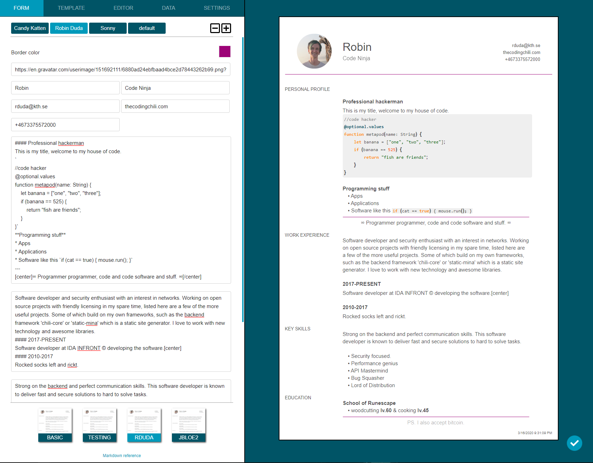

# Domplates
Domplates is a templating toolkit for making DOM-based templates in HTML, CSS and Javascript. 
The default export format is .pdf using the print to pdf feature present in most browsers. 

### Use cases
Reusable templates that can be used for

- Generating invoices.
- Quickly creating unique resumes.
- Infographics with full css support.
- Static websites with instant feedback.

### Features

Some notable features

- Live editing of template data with instant feedback
- Uses local storage and works offline.
- Live editing and syntax highlighting of custom templates
- Quickly switch between templates and data sets for previewing

Outstanding performance

- Uses local storage to persist data
- Web workers to speed up syntax highlighting
- Service workers for caching resources
- Custom elements and DOM API's for fast updates.

### Installing

The application can be added to the desktop with a single click from PWA enabled browsers.

There is currently no distribution point available for the software, please contact the developer
if you wish to request a trial version.

### License
All rights reserved.